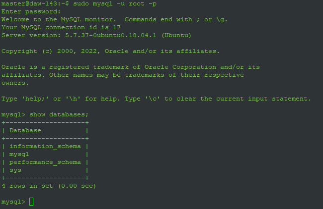

# Despliegue de Aplicaciones WEB

> Daniel Pérez, Claudia Trabanco y Aitor Merino


## Instalación y configuración de base de datos

1. Actualizamos los paquetes dentro de la maquina de Ubuntu.

   ```bash
   sudo apt-get update
   ```

2. Instalamos mysql-server y mysql-client.

   ```bash
   sudo apt-get install mysql-server mysql-client
   ```

3. Configuramos mysql_secure_installation.

   ```bash
   sudo  mysql_secure_installation
   ```

4. Entramos como admin en mysql.

   ```bash
   mysql -u root -p
   ```

- Comprobamos las bases de datos ya creadas:



5. Creamos la base de datos.

   ```mysql
   create database test_virtual;
   ```

- Comprobamos que se ha creado:

  
  

6. Creamos el usuario al que llamamos `user` y le ponemos la misma contraseña.

   ```mysql
   create user 'user'@'localhost' identified by 'user';
   ```

- Comprobación de todos los usuarios creados

  


7. Otorgamos todos los privilegios al usuario `user` en la base de datos `test_virtual`.

   ```mysql
   grant all privileges on test_virtual.* to 'user'@'localhost' with grant option;
   ```

8. Forzamos al servidor a recargar los privilegios asegurándonos de que dichos cambios se noten sin necesidad de reiniciar.

   ```mysql
   flush privileges;
   ```

<div style="page-break-after: always; break-after: page;"></div>

## Instalación de recursos necesarios y vsftpd

1. Instalamos maven.

```bash
sudo apt-get install maven
```

2. Instalamos openjdk8.

```bash
sudo apt-get install openjdk8
```

- Comprobamos la versión de Java:


3. Instalamos el vsftpd.

```bash
sudo apt-get install vsftpd
```

<div style="page-break-after: always; break-after: page;"></div>

## Despliegue del back

1. Descomentamos el atributo `write_enable=YES` del archivo de configuración del vsftpd:

   
   
   
   
2. Reiniciamos el vsftpd.service y nos aseguramos de que está `enabled`:

```bash
systemctl restart vsftpd.service
systemctl is-enabled vsftpd.service
```


3. Entramos en FileZilla usando el usuario master y añadimos el back dentro de Home:


4. Limpiamos el mvn y modificamos el pom.xml del virtualBACK:

```xml
<finalName>virtual</finalName>
```


5. Instalamos el mvn.

```bash
mvn install
```

6. Ejecutamos el archivo jar.

```bash
java -jar target/virtual.jar
```

- Encontramos algunos problemas al iniciar la aplicación Spring Boot ya que el puerto 8080 estaba ocupado.


7. Accedemos a la URL.

```
172.16.21.143:8080/tio/lista
```


8. Creamos el servicio y cambiamos algunos detalles.

```bash
nano etc/systemd/system/spring.service
```

9. Comprobamos si el servicio está funcionando.

```bash
systemctl enable spring.service
systemctl is-enabled spring.service
```


10. Iniciamos el servicio y lo comprobamos.

```bash
systemctl start spring.servicio
systemctl is-active spring.service
```


<div style="page-break-after: always; break-after: page;"></div>

## Despliegue del front

1. Instalamos Apache.

   ```bash
   sudo apt-get install Apache2
   ```

2. Copiamos index.html a /home.

   ```bash
   mv /var/www/html/index.html /home/
   ```

- Comprobamos que Apache se muestra:


3. Nos bajamos una extensión de Angular para crear el ejecutable tras instalar node js en Visual Studio Code.

   ```bash
   npm install -g @angular/cli
   ```

4. Creamos el proyecto del front.

   ```bash
   ng build --prod
   ```


5. Subimos los archivos a la carpeta /var/www/html como vemos en la imagen:

   

6. Cambiamos los permisos para poder acceder al servidor y algunas directivas:

   ```bash
   chmod -R 755 /var/www/html
   ```


<div style="page-break-after: always; break-after: page;"></div>

## Resultados de la tarea

- Ya se puede acceder al menú, hacer inserciones, editar y eliminar elementos:


